<div align="center">

# 🏠 Interio

### *A One-Stop Solution For All Your Interior Designing Hurdles*

[](https://www.ijraset.com/best-journal/an-indepth-evaluation-of-arbased-interior-design-and-decoration-applications)
[]()
[]()

**Transforming 2D floor plans into interactive 3D room models with AI-powered interior design capabilities**

---

</div>

<div align="justify">
### 📖 Overview

**Interio** is a revolutionary cross-platform mobile application that bridges the gap between imagination and reality in interior design. Unlike existing AR-based applications that rely on unstable live camera feeds, Interio generates **persistent 3D room models** from 2D floor plans, allowing users to design, customize, and save their interior layouts with complete creative freedom.

### 🎯 The Problem We Solved

**Existing Solutions Fall Short:**
- ❌ Require holding phone camera steady
- ❌ Only show items in specific areas
- ❌ Cannot save or revisit designs
- ❌ Limited customization options
- ❌ No complete room visualization
- ❌ Difficult UI for non-technical users

**Interio Delivers:**
- ✅ Stable 3D models from floor plans
- ✅ Complete 360° room visualization
- ✅ Save and reload designs anytime
- ✅ Full color & texture customization
- ✅ Entire infrastructure planning
- ✅ Intuitive, user-friendly interface

---

### ✨ Features

#### 🏗️ **Core Functionality**

```
📐 2D Floor Plan → 🎨 3D Room Model → 🪑 Furniture Placement → 💾 Design Storage
```

🔄 **Automated 3D Modeling**
- Upload hand-drawn or digital blueprints
- AI-powered edge & corner detection
- Automatic wall, door & window recognition
- Accurate dimensional conversion

🎨 **Smart Design Studio**
- 360° room navigation
- Drag-and-drop furniture placement
- Real-time color customization
- Material & texture modifications
- Complete wall paint options

💾 **Design Management**
- Save unlimited room designs
- Revisit and modify anytime
- Share designs with clients
- Export final visualizations
- Cloud-based storage


#### 🤖 **AI-Powered Features**

- **Object Detection**: Automatically identify existing furniture using mobile camera
- **Smart Placement Suggestions**: AI recommends optimal furniture arrangement
- **Edge Detection**: 91.6% accuracy using Canny Edge Detection algorithm
- **Corner Recognition**: 89% accuracy with Shi-Tomasi algorithm

---

### 🛠️ Technology Stack

<div align="center">

**Frontend & UI**


**3D Engine & Graphics**


**Backend & Processing**


</div>

### **Architecture Overview**


### **Dataset Statistics**

- **3D Object Models**: 300+ items across 6 categories
- **Floor Plan Images**: 150+ samples (blueprints + hand-drawn)
- **Interior Design References**: 200+ style images
- **Training Duration**: 11 months (2 development phases)

---

## 🎓 Research Publications

📄 **Published Papers**

<table>
<tr>
<td width="33%">

1️⃣ **IJRASET**
**Volume 11 Issue II**  
*February 2023*

"An In-Depth Evaluation of AR-Based Interior Design and Decoration Applications"

[📖 Read Paper](https://www.ijraset.com/best-journal/an-indepth-evaluation-of-arbased-interior-design-and-decoration-applications)

</td>
<td width="33%">

2️⃣ **IC2E3 2023**
**International Conference**

"Interio: A One-Stop Solution For All Your Interior Designing Hurdles"

*Computer, Electronics and Electrical Engineering Applications*

</td>
<td width="33%">

3️⃣ **ICACCD 2024**
**Springer Conference**

"Automated 2D-to-3D Room Modeling and Real-Time Object Placement"

*Advanced Computing & Design*

</td>
</tr>
</table>

### 🏆 **Key Contributions**

- Novel approach to persistent 3D room modeling from 2D plans
- Comparative analysis of edge detection algorithms for floor plans
- User experience study across 75+ participants (consumers, designers, businesses)
- Integration of computer vision with real-time 3D rendering
- Cross-platform mobile solution for interior design democratization

---

## 👥 Project Team

<div align="center">

**Developed at SIES Graduate School of Technology, Navi Mumbai**

<table>
<tr>
<td align="center">
<b>👨‍🎓 Nandita Nandakumar</b>
<strong>Lead Developer & Researcher</strong><br>
Computer Vision & Algorithms
</td>
<td align="center">
<b>👨‍🎓 Nipun Manghi</b>
<strong>Core Developer</strong><br>
Flutter & Unity Integration
</td>
<td align="center">
<b>👨‍🎓 Saahith Shetty</b>
<strong>Core Developer</strong><br>
3D Modeling & Backend
</td>
</tr>
<tr>
<td colspan="3" align="center">
<b>👩‍🏫 Dr. Deepti Reddy</b>
<strong>Project Guide & Mentor</strong><br>
Computer Science Department
</td>
</tr>
</table>

</div>

### 🙏 **Acknowledgments**

Special gratitude to:
- **Dr. Aparna Bannore** - HOD, Computer Engineering Department, SIES GST
- **Faculty Members** - SIES GST Computer Science Department
- **Industry Partners** - Interior designers, furniture store owners, and design professionals who provided valuable insights
- **Survey Participants** - 75+ users across consumer, student, and professional categories

---

## 📱 Application Workflow

```mermaid
graph TD
    A[Splash Screen] --> B[Login/Register]
    B --> C[Tutorial for New Users]
    C --> D[Home Dashboard]
    D --> E[Create New Room]
    D --> F[Choose Existing Room]
    D --> G[Buy Products]
    D --> H[Settings]
    
    E --> I[Upload Floor Plan]
    I --> J[API Processing]
    J --> K[3D Model Generated]
    K --> L[Design Studio]
    
    F --> L
    
    L --> M[Add Furniture]
    L --> N[Customize Objects]
    L --> O[360° Navigation]
    L --> P[Save Design]
    
    P --> Q[Firebase Storage]
    
    G --> R[Browse Categories]
    R --> S[Add to Cart]
    S --> T[Payment Gateway]
```




## 🚀 Future Enhancements

**Planned Features**

**🤖 AI & Machine Learning**
- [ ] CNN-based style classification (Modern, Royal, Chic, Minimalist)
- [ ] YOLO v8 for real-time object detection
- [ ] AI design recommendations based on room dimensions
- [ ] Automated furniture arrangement optimization

**🛒 E-Commerce Integration**
- [ ] In-app payment gateway (Razorpay/Stripe)
- [ ] Partnership with IKEA, Pepperfry, Urban Ladder
- [ ] Price comparison across vendors
- [ ] Virtual showroom tours

**👥 Collaboration Features**
- [ ] Multi-user design sessions
- [ ] Real-time design sharing with clients
- [ ] Comment and annotation system
- [ ] Version control for designs

**🎯 Advanced Visualization**
- [ ] AR preview mode for on-site visualization
- [ ] VR support for immersive walkthroughs
- [ ] Lighting simulation (natural & artificial)
- [ ] Day/night mode previews

**Technical Improvements**
- Improve hand-drawn blueprint accuracy to 90%+
- Reduce 3D model generation time by 40%
- Implement progressive loading for large models
- Add offline mode with local caching
- Expand object database to 1000+ items

---


### 🔐 Code Access

📩 **Request Repository Access**

The complete source code for **Interio** is currently **private** for intellectual property protection. We welcome collaboration and are open to sharing code for:

✅ **Academic Research** - Citation and comparative studies  
✅ **Educational Purposes** - Learning and teaching computer vision/3D modeling  
✅ **Industry Collaboration** - Partnership opportunities with interior design companies  
✅ **Open Source Contribution** - After official app launch  

**Contact for Code Access**

<div align="center">

| Team Member | Email | Role |
|:-----------:|:-----:|:----:|
| **Nandita Nandakumar** | nanditankr1062001@gmail.com | Lead Developer |

</div>

**What to Include in Your Request**
- Your name and affiliation (university/company)
- Purpose of access (research/education/collaboration)
- Specific components of interest (if partial access needed)
- Timeline for your project/research
- How you plan to cite/acknowledge our work

---

### 📚 Documentation

**Available Resources (on request via email)**

- 📄 **Full Thesis Report**: `FinalReport_BlackBook.pdf` 
- 📊 **Springer Conference Paper**: Complete methodology and results
- 📈 **Project Presentation**: Slide deck with architecture diagrams
- 🎥 **Demo Videos**: Application walkthrough and feature showcase

**Technical Documentation**

All technical details including:
- Algorithm pseudocode
- Database schema
- API endpoint specifications
- Unity-Flutter integration methods
- Firebase configuration
- Image processing pipeline

Available in published papers and upon code access.

</div>
---

### 📖 How to Cite

If you use or reference this work in your research, please cite:

**APA Format**
```
Nandakumar, N., Manghi, N., Shetty, S., & Reddy, D. (2023). 
An In-Depth Evaluation of AR-Based Interior Design and Decoration Applications. 
International Journal for Research in Applied Science and Engineering Technology (IJRASET), 
11(2). https://www.ijraset.com/best-journal/an-indepth-evaluation-of-arbased-interior-design-and-decoration-applications
```

**IEEE Format**
```
N. Nandakumar, N. Manghi, S. Shetty, and D. Reddy, 
"Automated 2D-to-3D Room Modeling and Real-Time Object Placement: 
A Cross-Platform Solution for Interior Design Visualizations," 
in Proc. Int. Conf. Advanced Computing and Communication Design (ICACCD), 2024.
```

---

### 📜 License

This project is currently under **proprietary license**. All rights reserved.

For licensing inquiries, please contact the team via the emails provided above.

---

### 🌟 Star History

If you find this project interesting, please consider starring the repository (once made public) to show your support!

---

<div align="center">

### 🏡 **Transforming Imagination into Reality, One Room at a Time** 🏡

---

**Made with ❤️ at SIES Graduate School of Technology, Navi Mumbai**

© 2023 Interio Team. All Rights Reserved.

[](https://www.linkedin.com/in/nandita-nandakumar-1320a91b0/)
[](mailto:nandita19@siesgst.ac.in)

</div>
